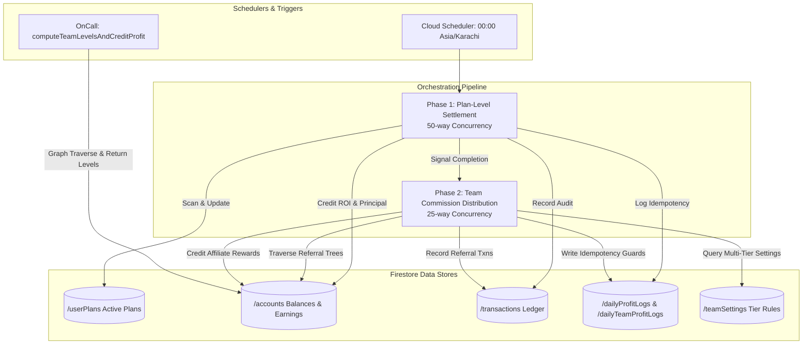
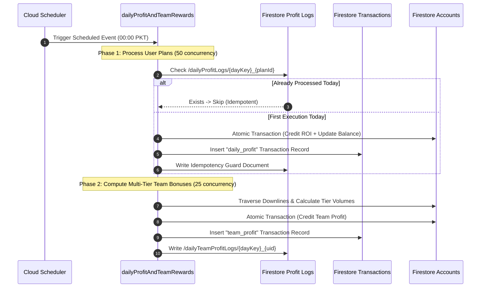

# AI Trust Ledger (Cloud Functions Engine)

[](https://firebase.google.com/docs/functions)
[](https://nodejs.org)
[](https://firebase.google.com/docs/firestore)
[](https://www.npmjs.com/package/p-limit)
[](LICENSE)

> High-throughput serverless financial settlement engine built with Firebase Cloud Functions v2, orchestrating daily ROI payouts, MLM referral tree calculations, plan expiration settlements, and idempotent batch processing.

---

## 📖 Overview

The **AI Trust Ledger Cloud Functions** repository houses the mission-critical financial settlement backend for the AI Trust Ledger ecosystem. Engineered using **Firebase Cloud Functions v2**, **Node.js**, and the **Firebase Admin SDK**, this system executes distributed, fault-tolerant batch accounting at midnight every night (Asia/Karachi timezone) while serving on-demand callable functions for graph tree traversals.

### System Responsibilities
- **Automated Daily Yield Accrual**: Calculates and credits daily ROI for active stock, forex, and medical investment contracts.
- **Capital Liquidation & Plan Expiration**: Automatically matures expired venture contracts, returning principal capital plus bonus yields to investor balances.
- **Hierarchical MLM Commission Traversal**: Traverses multi-tier affiliate trees to distribute downline performance bonuses according to dynamic Firestore configurations.
- **Idempotency & Concurrency Control**: Employs double-entry guard collections (`/dailyProfitLogs`, `/dailyTeamProfitLogs`) and semaphore concurrency throttling (`p-limit`) to prevent double-spending and contention errors.

---

## 🏗️ Architecture & Cron Execution Lifecycle



### Nightly Batch Processing State Machine



---

## ✨ Core Functions & Modules

### 1. ⏱️ `dailyprofitandteamrewards.js`
- **Schedule**: `0 0 * * *` (Daily at midnight, Asia/Karachi time).
- **Plan Matures & Finalization**: Detects expired medical plans, changes state to `medicine_expired`, returns invested principal, and logs `investment_sold`.
- **Missed-Day Profit Aggregator**: Handles multi-day catching-up algorithms if maintenance occurs, calculating exact accrued returns between `lastTrackedDate` and current midnight.
- **Team MLM Reward Engine**: Reads active tier settings from `/teamSettings`, parses user downline chains, evaluates minimum active member requirements, and credits upstream bonuses.
- **Transaction Retry Resilience**: Custom `runTxnWithRetry` helper providing exponential backoff on Firestore `ABORTED` (code 10) and `DEADLINE_EXCEEDED` (code 4) status codes.

### 2. 🌲 `computeteamlevelsandcreditprofit.js`
- **Trigger**: `onCall` (Firebase v2 HTTPS Callable).
- **Parameters**: `{ userId: string }`.
- **Functionality**: Dynamically queries `/teamSettings` and performs a breadth-first traversal of the user's referral tree using 10-item query chunking (`where("referralCode", "in", chunk)`).
- **Return Payload**: Structured array containing per-level user lists, names, contact identifiers, and aggregated volume statistics for client rendering.

---

## 🛠️ Technical Stack Matrix

| Component | Technology | Description |
|---|---|---|
| **Platform** | Firebase Cloud Functions v2 | Cloud Run serverless container runtime |
| **Runtime** | Node.js 20.x | Modern JavaScript execution engine |
| **SDK** | `firebase-admin` (v12+), `firebase-functions` (v5+) | Firestore NoSQL Admin API and 2nd Gen triggers |
| **Concurrency Control** | `p-limit` | Concurrency limiting for asynchronous batch pipelines |
| **Database** | Google Cloud Firestore | ACID transactional NoSQL document database |
| **Scheduler** | Google Cloud Scheduler | Enterprise cron trigger infrastructure |

---

## 🚀 Getting Started

### Prerequisites
- **Node.js** (v18 or v20 LTS).
- **Firebase CLI** installed globally:
  ```bash
  npm install -g firebase-tools
  ```
- Access to a Firebase Project with **Firestore** and **Cloud Functions (Blaze Plan)** enabled.

### Local Installation & Deployment

1. **Clone the Repository**:
   ```bash
   git clone https://github.com/shayann07/Ai-Trust-Ledger-Cloud-Functions.git
   cd Ai-Trust-Ledger-Cloud-Functions
   ```

2. **Install Node Dependencies**:
   ```bash
   npm install firebase-functions@latest firebase-admin@latest p-limit
   ```

3. **Firebase Authentication & Target Selection**:
   ```bash
   firebase login
   firebase use <your-project-id>
   ```

4. **Deploy Cloud Functions to GCP**:
   ```bash
   # Deploy all functions
   firebase deploy --only functions

   # Deploy specific scheduled runner
   firebase deploy --only functions:dailyprofitandteamrewards
   ```

---

## 📄 License

This project is open-source software licensed under the [MIT License](LICENSE) — Copyright (c) 2026 [shayann07](https://github.com/shayann07).
